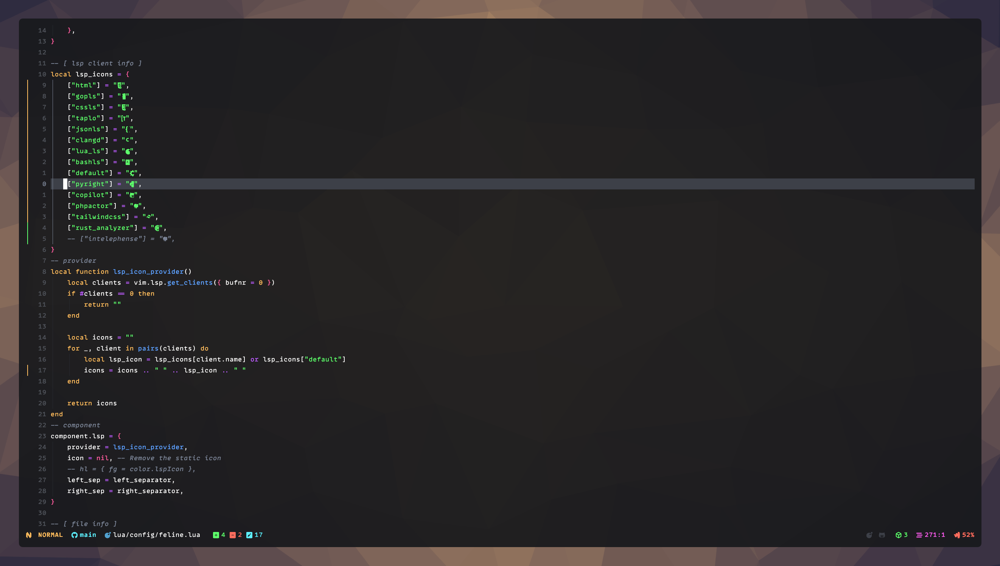

## My dotfiles

#### Use at your own risk 😎

**Theme**: [cyberdream](https://github.com/scottmckendry/cyberdream.nvim)

**Windowmanager**: [Yabai](https://github.com/koekeishiya/yabai)

### Yabai + kitty

Aerospace shown here!

### nvim

### nvim + feline statusline

### Credits

Special thanks to all the dev community in github who has made these wonderfull tools and all the awesome .dotfiles I copied from!
